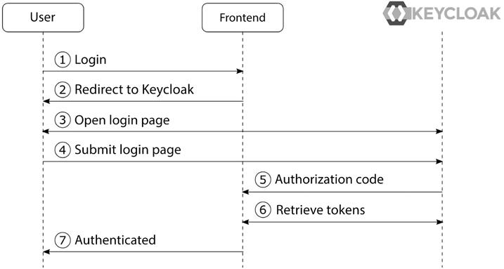
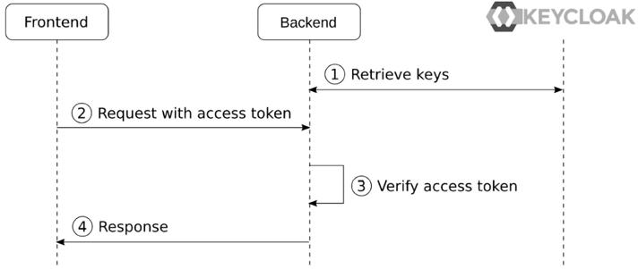

### How to export a realm

1. Login to the Docker container shell:

```shell
$ docker exec -it keycloak bash
```

2. Proceed to the Keycloak directory `/opt/keycloak/bin`;

3. Run export procedure `./kc.sh export --file <FILE_NAME> --realm <REALM_NAME>`:

```shell
bash-5.1$ ./kc.sh export --file realm-myrealm-exported.json --realm myrealm
2024-08-23 08:36:06,423 INFO  [org.keycloak.quarkus.runtime.hostname.DefaultHostnameProvider] (main) Hostname settings: Base URL: <unset>, Hostname: <request>, Strict HTTPS: false, Path: <request>, Strict BackChannel: false, Admin URL: <unset>, Admin: <request>, Port: -1, Proxied: false
2024-08-23 08:36:07,353 WARN  [io.quarkus.agroal.runtime.DataSources] (main) Datasource <default> enables XA but transaction recovery is not enabled. Please enable transaction recovery by setting quarkus.transaction-manager.enable-recovery=true, otherwise data may be lost if the application is terminated abruptly
2024-08-23 08:36:07,641 WARN  [org.infinispan.PERSISTENCE] (keycloak-cache-init) ISPN000554: jboss-marshalling is deprecated and planned for removal
2024-08-23 08:36:07,703 INFO  [org.infinispan.CONTAINER] (keycloak-cache-init) ISPN000556: Starting user marshaller 'org.infinispan.jboss.marshalling.core.JBossUserMarshaller'
2024-08-23 08:36:07,967 INFO  [org.keycloak.connections.infinispan.DefaultInfinispanConnectionProviderFactory] (main) Node name: node_822364, Site name: null
2024-08-23 08:36:08,271 INFO  [org.keycloak.broker.provider.AbstractIdentityProviderMapper] (main) Registering class org.keycloak.broker.provider.mappersync.ConfigSyncEventListener
2024-08-23 08:36:08,580 INFO  [org.keycloak.services] (main) KC-SERVICES0034: Export of realm 'myrealm' requested.
2024-08-23 08:36:08,580 INFO  [org.keycloak.exportimport.singlefile.SingleFileExportProvider] (main) Exporting realm 'myrealm' into file /opt/keycloak/bin/realm-myrealm-exported.json
2024-08-23 08:36:08,965 INFO  [org.keycloak.services] (main) KC-SERVICES0035: Export finished successfully
2024-08-23 08:36:09,001 INFO  [io.quarkus] (main) Keycloak 22.0.0 on JVM (powered by Quarkus 3.2.0.Final) started in 3.178s. Listening on: 
2024-08-23 08:36:09,001 INFO  [io.quarkus] (main) Profile import_export activated. 
2024-08-23 08:36:09,001 INFO  [io.quarkus] (main) Installed features: [agroal, cdi, hibernate-orm, jdbc-h2, jdbc-mariadb, jdbc-mssql, jdbc-mysql, jdbc-oracle, jdbc-postgresql, keycloak, logging-gelf, micrometer, narayana-jta, reactive-routes, resteasy, resteasy-jackson, smallrye-context-propagation, smallrye-health, vertx]
2024-08-23 08:36:09,024 INFO  [io.quarkus] (main) Keycloak stopped in 0.021s
```

4. On local machine the exported file can be found in local Docker container file:

```shell
$ sudo find / -name "realm-myrealm-exported.json" -type f
/var/snap/docker/common/var-lib-docker/overlay2/.../diff/opt/keycloak/bin/realm-myrealm-exported.json
```

It's a sudo directory so copy the file to the accessible location:

```shell
$ sudo cp /var/snap/docker/common/var-lib-docker/overlay2/10208ebe783a5c88abdd50a8b9503c5c9dc812c05016f17758af4edcff6ebcdb/diff/opt/keycloak/bin/realm-myrealm-exported.json /home/oleg/MyProjects/keycloak-iam/keycloak/config
```

And change the access:

```shell
$ ls -la
total 76
drwxrwxr-x 2 oleg oleg  4096 авг 23 11:42 .
drwxrwxr-x 3 oleg oleg  4096 авг 23 09:31 ..
-rw-r--r-- 1 root root 66617 авг 23 11:42 realm-myrealm-exported.json

 11:43:05  oleg@oleg-desktop-linux  ...keycloak-iam/keycloak/config  ⬡ v20.16.0 
$ sudo chown oleg:oleg realm-myrealm-exported.json 
[sudo] password for oleg: 

 11:43:21  oleg@oleg-desktop-linux  ...keycloak-iam/keycloak/config  ⬡ v20.16.0 
$ ls -la
total 76
drwxrwxr-x 2 oleg oleg  4096 авг 23 11:42 .
drwxrwxr-x 3 oleg oleg  4096 авг 23 09:31 ..
-rw-r--r-- 1 oleg oleg 66617 авг 23 11:42 realm-myrealm-exported.json

```

File to be imported by Keycloak during startup must be located in Docker container
path: `/opt/keycloak/data/import/realm-myrealm-exported.json`

---

User console:
http://localhost:8080/realms/myrealm/account/#/

---

### Authorization procedure ("Authorization code flow, ID Connect"):

---

#### Frontend:

1. The User clicks on the login button;
2. The application redirects to the Keycloak Login page;
3. The Keycloak login page is displayed to the User;
4. The User fills in the username and password and submits the results to Keycloak;
5. After verifying the username and password, Keycloak sends the `Authorization code` to the application (allowed CORS-requests needed?);
6. The application exchanges the `Authorization code` for an `ID Token` and an `Access Token`. The application can now verify the identity
   of the user by inspecting the ID token.



### Tokens issued by Keycloak:

<table>
<tr align="center">
<td> <b>ID Token</b> </td> <td> <b>Access Token</b> </td>
</tr>
<tr  valign="top">
<td>

```json
{
  "exp": 1725098762,
  "iat": 1725098462,
  "auth_time": 1725098459,
  "jti": "d7108acc-d082-4078-9db0-25e67427fcff",
  "iss": "http://localhost:8080/realms/myrealm",
  "aud": "myclient",
  "sub": "5ab16a86-6977-41f8-a50c-735b89ecd812",
  "typ": "ID",
  "azp": "myclient",
  "nonce": "e6b3ed86-2087-43f0-bcf1-287a5bff060e",
  "session_state": "a1e5f9e2-9cde-43ba-9237-8faed3e8d282",
  "at_hash": "H0Qo_SKblXwIP0_NQODaNg",
  "acr": "1",
  "sid": "a1e5f9e2-9cde-43ba-9237-8faed3e8d282",
  "email_verified": true,
  "name": "UserFirstName UserLastName",
  "preferred_username": "keycloak",
  "given_name": "UserFirstName",
  "family_name": "UserLastName",
  "picture": "https://59.img.avito.st/avatar/social/256x256/4925113259.jpg",
  "email": "keycloak@keycloak.org"
}
```

</td>
<td>

```json
{
  "exp": 1725098762,
  "iat": 1725098462,
  "auth_time": 1725098459,
  "jti": "888c0ae8-cce4-4341-a066-18f9afca6234",
  "iss": "http://localhost:8080/realms/myrealm",
  "aud": "account",
  "sub": "5ab16a86-6977-41f8-a50c-735b89ecd812",
  "typ": "Bearer",
  "azp": "myclient",
  "nonce": "e6b3ed86-2087-43f0-bcf1-287a5bff060e",
  "session_state": "a1e5f9e2-9cde-43ba-9237-8faed3e8d282",
  "acr": "1",
  "allowed-origins": [
    "http://localhost:8000"
  ],
  "realm_access": {
    "roles": [
      "default-roles-myrealm",
      "offline_access",
      "uma_authorization",
      "myrole"
    ]
  },
  "resource_access": {
    "account": {
      "roles": [
        "manage-account",
        "manage-account-links",
        "view-profile"
      ]
    }
  },
  "scope": "openid profile email",
  "sid": "a1e5f9e2-9cde-43ba-9237-8faed3e8d282",
  "email_verified": true,
  "name": "UserFirstName UserLastName",
  "preferred_username": "keycloak",
  "given_name": "UserFirstName",
  "family_name": "UserLastName",
  "picture": "https://59.img.avito.st/avatar/social/256x256/4925113259.jpg",
  "email": "keycloak@keycloak.org"
}
```

</td>
</tr>
<td>
</table>

---

#### Backend (frontend sends a request to the backend):

1. Backend retrieves the Keycloak's `Public keys` and caches them in memory;
2. The Frontend sends a request to the Backend, including the `Access token`;
3. The Backend uses the `Public keys` to verify the `Access token` (if the `Token` issued by the Keycloak, valid and contains
   necessary `Role`);
4. The Backend returns the results to the Frontend.



---


